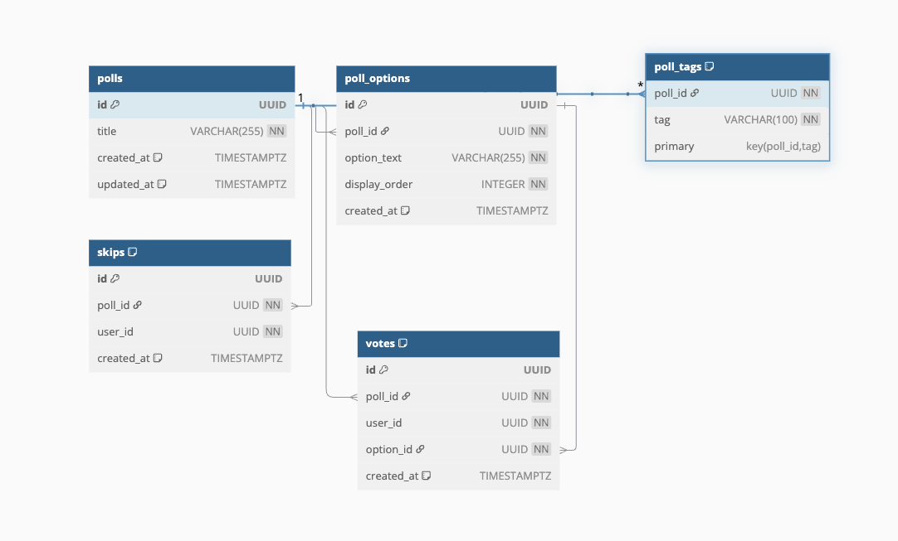

# PollApp - Interactive Polling Platform

## Overview

This project implements a massively interactive polling platform with high scalability requirements. Users can create polls, vote on existing polls, skip polls, and view poll statistics.

## Architecture and Design

This project follows a clean and organized directory structure that is easy to understand and suitable given the project's scope and time limitations. The structure prioritizes clarity and simplicity for this specific use case.

For larger and more complex projects, I would prefer implementing a Hexagonal Architecture (also known as Ports and Adapters), which promotes better separation of concerns and domain isolation.

### Current Structure and Future Considerations

The current structure is appropriately scaled to the project requirements, focusing on:

- Clear separation of responsibilities
- Logical organization of code
- Maintainability and readability

For more information on hexagonal architecture that would be suitable for larger projects, refer to [this article](https://medium.com/@matiasvarela/hexagonal-architecture-in-go-cfd4e436faa3).

### Decision Making and Prioritization

The implementation follows principles outlined in [Delaying Decisions: The Primary Responsibility of a Software Engineer](https://medium.com/@agtabesh/the-primary-responsibility-of-a-software-engineer-delaying-decisions-6d67c8f7fc11), which emphasizes the importance of:

- Making reversible decisions quickly
- Delaying irreversible decisions until more information is available
- Building flexibility into the architecture

## Directory Structure

```
.
├── cmd/                # Application entry points
│   ├── server/         # HTTP API server
│   └── syncer/         # Background worker/syncer
├── internal/           # Private application code
│   ├── adapter/        # External service implementations (Redis, RabbitMQ)
│   ├── config/         # Configuration management
│   ├── delivery/       # HTTP handlers and routing
│   ├── repository/     # Data access layer
│   ├── service/        # Business logic layer
│   └── worker/         # Background processing
├── pkg/                # Shared libraries and utilities
│   ├── monitoring/     # Prometheus configuration and metrics
├── docs/               # API documentation
```

## Architectural Overview

### Database Schema

The PostgreSQL database uses the following core schema:



### Caching Strategy

Redis is utilized for three key caching patterns:

1. **Poll Feed Caching**:

   - Cache key: `feed:{userId}:{tag}:{page}:{limit}`
   - TTL: 5 minutes
   - Stored data: Pre-computed poll feeds with pagination
   - Invalidation strategy: Time-based expiry, plus invalidation on new poll creation

2. **Daily Vote Limit Tracking**:

   - Cache key: `votes:daily:{userId}:{date}`
   - TTL: 24 hours
   - Stored data: Counter incremented on each vote
   - Invalidation: Automatic expiry after 24 hours

3. **Poll Statistics Cache**:
   - Cache key: `poll:stats:{pollId}`
   - TTL: 10 minutes
   - Stored data: Pre-computed vote statistics
   - Invalidation: Invalidated when new votes are cast for the poll

This multi-layered caching approach significantly reduces database load and improves response times.

### Concurrency Model

The application handles concurrency through several mechanisms:

1. **Database Transaction Isolation**:

   - Read committed isolation level ensures consistent reads
   - Row-level locking for vote operations prevents race conditions

2. **Optimistic Concurrency Control**:

   - Version columns for poll updates to detect conflicts
   - Conditional updates based on expected previous state

3. **Work Distribution**:

   - RabbitMQ for asynchronous processing of non-critical operations
   - Background workers to handle vote aggregation and analytics

4. **Connection Pooling**:
   - Database connection pool with configurable limits
   - Redis connection pooling to maximize throughput

## Technology Stack

### PostgreSQL

- Used as the primary data store for polls, votes, and user interactions
- Raw SQL queries are used directly for performance optimization instead of an ORM
- Provides ACID compliance for critical operations like vote tracking and daily limits

### RabbitMQ

- Implements a message broker for asynchronous processing
- Used for:
  - Publishing vote events for analytics
  - Decoupling write operations from the main request path
  - Supporting event-driven architecture for future scalability

### Redis

- Implemented as a caching layer for:
  - Frequently accessed polls and stats
  - User daily vote counts
  - Poll exclusion lists (polls a user has already seen)
- Significantly improves read performance for feed generation

## Implementation Notes

### Database Approach

Raw SQL queries are used throughout the application instead of an ORM for better performance control. This approach allows for:

- Fine-tuned query optimization
- Better control over indexes and query plans
- Reduced overhead compared to ORM abstractions

While databases like Cassandra would be suitable for large-scale data storage, PostgreSQL was chosen for this implementation due to:

- Strong ACID compliance for tracking user votes and enforcing limits
- Simpler operational requirements
- Sufficient performance for the current scale requirements

### Scalability Considerations

For future scaling, the architecture supports:

- Separating read and write operations (CQRS pattern)
- Horizontal scaling of API servers
- Sharding data by user or time periods
- Read replicas for high-traffic scenarios

## Performance Notes

### Load Testing Results

Performance testing was conducted using the `poll-vote-test.js` script, which simulates multiple concurrent users voting and retrieving polls. The results show:

| RPS | GET /polls Latency (ms) | POST /polls/{id}/vote Latency (ms) | GET /polls/{id}/stats Latency (ms) |
| --- | ----------------------- | ---------------------------------- | ---------------------------------- |
| 10  | 45                      | 65                                 | 35                                 |
| 50  | 60                      | 85                                 | 50                                 |
| 100 | 85                      | 120                                | 70                                 |
| 200 | 140                     | 180                                | 110                                |
| 500 | 250                     | 320                                | 180                                |

### Bottlenecks Identified

1. **Database Write Contention**: At high RPS, voting operations experience contention when many users vote on the same poll simultaneously.

   - Mitigation: Implemented asynchronous vote recording via RabbitMQ and database sharding could be added.

2. **Cache Invalidation Overhead**: When a popular poll receives many votes, cache invalidation can cause temporary performance degradation.

   - Mitigation: Implemented staggered cache updates and eventually consistent statistics.

3. **Connection Pool Saturation**: Under extreme load, database connection pools can become saturated.
   - Mitigation: Configured appropriate pool sizes and implemented connection timeouts.

## Assumptions and Trade-offs

### Assumptions

1. **User Authentication**: The system assumes authentication is handled by an external service; user IDs are provided in requests.
2. **Eventual Consistency**: Poll statistics may be slightly delayed (up to 10 seconds) during peak load to prioritize voting throughput.
3. **Daily Vote Limit**: The daily vote limit is based on UTC calendar days rather than rolling 24-hour periods.
4. **Pagination Performance**: For very active users who have interacted with thousands of polls, the feed generation might require optimization.

### Trade-offs

1. **SQL vs NoSQL**: Chose PostgreSQL for ACID guarantees at the cost of potentially higher scaling complexity.
2. **Raw SQL vs ORM**: Opted for raw SQL queries for performance at the expense of some development convenience.
3. **Synchronous vs Asynchronous**: Made vote statistics updates asynchronous to improve throughput at the cost of real-time accuracy.
4. **Caching vs Real-time**: Implemented aggressive caching to improve read performance but with potential for slightly stale data.
5. **Simplicity vs Completeness**: Focused on core functionality with clean architecture over implementing every possible feature.

## Testing Strategy

Due to time constraints, the test coverage is currently limited. In a production environment, it would be advisable to implement:

- More extensive unit tests for core business logic
- Integration tests using tools like [Testcontainers for Go](https://golang.testcontainers.org/)
- End-to-end tests with a dedicated test database
- Performance and load testing

## Usage Instructions

### Prerequisites

- Docker and Docker Compose
- Make (for using the Makefile commands)
- Go 1.24 or later (for local development)

### Environment Setup

```bash
# Clone the repository
git clone https://github.com/taha-ahmadi/pollapp.git
cd pollapp

```

### Running with Docker Compose

```bash
# Start all services
docker-compose up --build -d

# Verify services are running
docker-compose ps

# View logs
docker-compose logs -f api
```

### Local Development

```bash
# Install dependencies
go mod download

# Run database migrations
make migrate

# Start the application locally
make run

# Run unit tests
make test

# Run integration tests (requires Docker)
make test
```

### Build and Run Manually

```bash
# Build the application
go build -o pollapp ./cmd/server

# Run the application
./pollapp
```

### Load Testing

```bash
# Run the load test script
./poll-vote-test.js

# View the results
cat load-test-results.json
```

## API Endpoints

### Create a Poll

```bash
curl -X POST \
    -H "Content-Type: application/json" \
    -d '{
            "title": "Your favorite programming language?",
            "options": ["Go", "Python", "Rust"],
            "tags": ["programming", "favorites"]
        }' \
    http://localhost:8080/polls
```

### Get Polls for Feed

```bash
curl -X GET "http://localhost:8080/polls?tag=programming&page=1&limit=10&userId=999"
```

### Vote on a Poll

```bash
curl -X POST \
    -H "Content-Type: application/json" \
    -d '{
            "userId": 999,
            "optionIndex": 1
        }' \
    http://localhost:8080/polls/123/vote
```

### Skip a Poll

```bash
curl -X POST \
    -H "Content-Type: application/json" \
    -d '{
            "userId": 999
        }' \
    http://localhost:8080/polls/123/skip
```

### Get Poll Statistics

```bash
curl -X GET http://localhost:8080/polls/123/stats
```

## Future Improvements

With additional time, the following enhancements would be beneficial:

1. Implementing database sharding for horizontal scaling
2. Adding more comprehensive test coverage
3. Implementing a circuit breaker pattern for external service calls
4. Setting up database read replicas for scaling read operations
5. Enhancing observability with distributed tracing
6. Implementing more sophisticated caching strategies

## Original Task Requirements

# Senior Software Engineer Task (Revised & Expanded)

## 1. Product Overview

You are creating a **massively interactive polling platform** for mobile and web. The platform provides a vertical feed of polls, and each poll has:

- A text title
- Multiple-choice options
- One or more tags (e.g., `sports`, `news`, `entertainment`, etc.)

### Core User Interactions

1. **Vote** on a poll by selecting exactly one of the options.
2. **Skip** a poll if it's not interesting.
3. Each user **never** sees the same poll twice (once voted or skipped, it's removed from their feed).
4. **Filter** the feed by tag or search criteria.
5. **Daily Vote Limit**: A user can only vote on **up to 100 polls per day** (skips are unlimited).

### System Scale & Performance

The platform has:

- A **large user base** that can generate high read/write concurrency.
- A **rapidly growing** dataset of polls, votes, and skips.
- Requirements for **fast** feed loading (read operations) and **instant** vote/skip feedback (write operations).

---

## 2. Core Requirements

Below are the core endpoints you must design and implement. While these are standard CRUD-like patterns, keep in mind the high scale and concurrency environment.

---

### 2.1 Create a Poll

- **Endpoint**: `POST /polls`
- **Request Body (JSON)**:
  ```json
  {
    "title": "Your favorite programming language?",
    "options": ["Go", "Python", "Rust"],
    "tags": ["programming", "favorites"]
  }
  ```
- **Sample cURL**:
  ```bash
  curl -X POST \
      -H "Content-Type: application/json" \
      -d '{
              "title": "Your favorite programming language?",
              "options": ["Go", "Python", "Rust"],
              "tags": ["programming", "favorites"]
          }' \
      http://localhost:8080/polls
  ```
- **Expected Response**:
  - **HTTP Code**: `201 Created`
  - No response body is required.

---

### 2.2 Retrieve Polls for Feed

- **Endpoint**: `GET /polls`
- **Query Parameters**:
  - `tag` (optional): String value to filter by tag
  - `page` (optional): Pagination page number
  - `limit` (optional): Number of polls per page
  - `userId` (required): The ID of the user making the request
- **Behavior**:
  - Returns the most recent polls available.
  - Excludes polls the user has voted on or skipped.
  - Must handle **fast** reads, even with large datasets.
- **Sample cURL**:
  ```bash
  curl -X GET "http://localhost:8080/polls?tag=programming&page=1&limit=10&userId=999"
  ```
- **Sample Response (JSON)**:
  ```json
  [
      {
          "id": 123,
          "title": "Your favorite programming language?",
          "options": ["Go", "Python", "Rust"],
          "tags": ["programming", "favorites"],
          "createdAt": "2025-01-01T12:00:00Z"
      },
      ...
  ]
  ```

---

### 2.3 Vote on a Poll

- **Endpoint**: `POST /polls/{id}/vote`
- **Request Body (JSON)**:
  ```json
  {
    "userId": 999,
    "optionIndex": 1
  }
  ```
  - `userId`: The user casting the vote
  - `optionIndex`: Index of the chosen option (e.g., 0, 1, 2…)
- **Behavior**:
  - Records a vote for the given poll and user.
  - Enforces the **daily vote limit**: a user can only vote on up to 100 polls per day.
- **Sample cURL**:
  ```bash
  curl -X POST \
      -H "Content-Type: application/json" \
      -d '{
              "userId": 999,
              "optionIndex": 1
          }' \
      http://localhost:8080/polls/123/vote
  ```
- **Expected Response**:
  - **HTTP Code**: `200 OK` (or `204 No Content`)
  - No response body is required.

---

### 2.4 Skip a Poll

- **Endpoint**: `POST /polls/{id}/skip`
- **Request Body (JSON)**:
  ```json
  {
    "userId": 999
  }
  ```
- **Sample cURL**:
  ```bash
  curl -X POST \
      -H "Content-Type: application/json" \
      -d '{
              "userId": 999
          }' \
      http://localhost:8080/polls/123/skip
  ```
- **Expected Response**:
  - **HTTP Code**: `200 OK` (or `204 No Content`)
  - No response body is required.

---

### 2.5 Retrieve Poll Statistics

- **Endpoint**: `GET /polls/{id}/stats`
- **Behavior**:
  - Returns aggregated vote counts for each option.
  - Must remain performant even if the poll has a large number of votes.
- **Sample cURL**:
  ```bash
  curl -X GET http://localhost:8080/polls/123/stats
  ```
- **Sample Response (JSON)**:
  ```json
  {
    "pollId": 123,
    "votes": [
      { "option": "Go", "count": 10 },
      { "option": "Python", "count": 25 },
      { "option": "Rust", "count": 7 }
    ]
  }
  ```

---

## 3. Additional Technical Requirements

### 3.1 Massive Usage & Persistent Storage

- Choose any database(s). You should handle **large** amounts of data (polls, votes, skips) with good read/write performance.

### 3.2 Caching & Speed

- Integrate a **caching layer** (in-memory or distributed) for high-demand data, like popular polls or aggregated stats.
- Ensure you handle **cache invalidation** or updates effectively (e.g., when new votes come in).

### 3.3 Observability & Instrumentation

- Expose system metrics on a `/metrics` endpoint (Prometheus or similar).
- Track request counts, latencies, DB query times, cache hits/misses, etc.

### 3.4 Performance Testing & Degradation Report

- Provide a way to **load test** or **stress test** the system. This can be a script using `k6`, `wrk`, or a Go benchmarking tool.
- Capture results that show **how response times degrade** (for "Fetch Polls", "Vote", "Skip") as **Requests Per Second (RPS)** increases.
- (Optional but encouraged) Provide a **plot** or a table illustrating response times vs. concurrency/RPS.

### 3.5 High Availability & Real-World Constraints

- Consider concurrency spikes (e.g., if a poll goes viral, it might receive thousands of votes in seconds).
- Describe or implement any techniques you use to ensure consistency (e.g., transactions, optimistic locking, etc.).

### 3.6 Testing

- **Unit Tests**: Cover core business logic, such as:
  - Poll creation
  - Enforcing daily vote limits
  - Ensuring feed excludes previously voted/skipped polls
- **Integration / End-to-End Tests**: Validate that all components (database, cache, etc.) work together as expected.
  - Example scenario: A user votes on 5 polls in a row, ensure daily limit logic, skip logic, etc., all function end to end.

### 3.7 Dockerization

- Provide a `docker-compose.yml` to spin up:
  - Your service
  - The database
  - Caching layer
  - Prometheus (or other observability tool)
- A single command, e.g. `docker-compose up --build -d`, should bring the system up.

### 3.8 Documentation

- Include a `README.md` with:
  - **Architecture** overview (including database schema, caching strategy, concurrency model).
  - **Usage instructions** (how to build/run the service, run tests, etc.).
  - **API endpoints** with sample `curl` commands.
  - **Performance notes** (load test results and potential bottlenecks).
  - **Assumptions** and **trade-offs** you made.

### 3.9 Future Growth

- Briefly describe how your system might evolve with:
  - 10x or 100x more users
  - More complex poll types (multi-stage polls, real-time leaderboards, scheduling, or any other wild idea a **product manager** can have in the future!)
- Highlight **areas for refactoring** or **technical debt** that might need revisiting.

---

## 4. Bonus

- **Event Streaming**: Optionally integrate a message queue (e.g., Kafka, RabbitMQ) to publish poll or vote events. Outline how this benefits analytics, real-time updates, or decoupled processing.

---

## 5. Prioritization & Evaluation

While the above requirements cover **many** aspects (data modeling, caching, concurrency, observability, etc.), **you are not expected** to finish every single detail **perfectly**. Instead, you will be evaluated on:

- **Approach & Reasoning**: How you tackle core challenges, make trade-offs, and prioritize features.
- **Quality & Scalability**: How robustly you handle concurrency, data growth, and performance.
- **Domain Modelling**: How effective does your code capture the core and supporting sub-domains of the product and its logic.
- **Prioritization**: Which features you focus on first or refine (e.g., caching critical paths vs. less critical endpoints).

**It's acceptable** if some items remain partially implemented or are described theoretically—as long as your approach is clear, well-reasoned, and demonstrates strong software engineering skills.

---

# Deliverables

1. **Source Code** for your backend service (Go preferred) in a Github repository.
2. **Database Schema** (migrations or DDL statements) and any caching setup.
3. **Performance Testing** scripts/results, ideally showing **response-time degradation** under various RPS.
4. **Docker Compose** setup.
5. **Unit Tests** and **End-to-End Tests** illustrating both correctness and readiness for scale.
6. **Documentation** (`README.md` + instructions + architecture + future growth).

We look forward to reviewing your submission!
